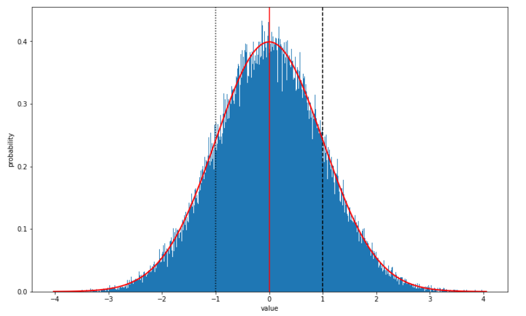

<h1>
Normal distribution generator</h1>

<h2>Notebook creator</h2>

Manuel **David** Soto. MSc in Geological Sciences, University of Texas
at Austin, USA.

<h2>About this notebook</h2>

In this notebook a ramdon normal variable (var) is generated from the np.random.normal function and its corresponding parameters (mean, standard deviation, bins plot, and number of sample). Then this variable is plotted in various ways, including in each plot the some statistical parameters of the variable. Additionally, in one of the histograms, the theoretical normal curve that correspond to the parameters of the variables is shown.

The best way to run the Notebook is changing the parameter in cell two and then run the whole notebook with the **Run All** option available in the **Cell** menu o fthe notebook.  

<h2>Libraries for notebook</h2>

Here is a list of libraries necessary for this notebook:

    numpy
    matplotlib
    scipy
